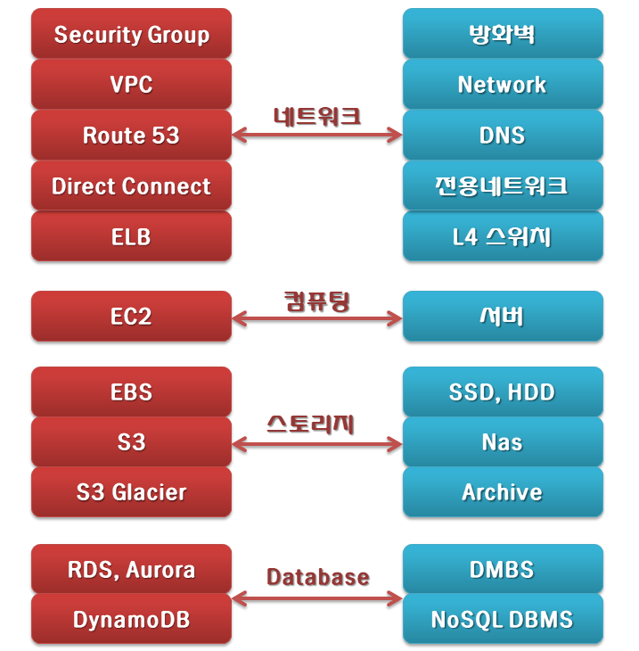

# AWS 알아가기

## 목차
[00_EC2](https://github.com/jihyeonmun/AWS-Docker-Kubernetes-Nginx/tree/main/00_AWS/00_EC2)
[01_S3](https://github.com/jihyeonmun/AWS-Docker-Kubernetes-Nginx/tree/main/00_AWS/01_S3)
[02_RDS](https://github.com/jihyeonmun/AWS-Docker-Kubernetes-Nginx/tree/main/00_AWS/02_RDS)
[03_VPC](https://github.com/jihyeonmun/AWS-Docker-Kubernetes-Nginx/tree/main/00_AWS/03_VPC)
[04_ELB](https://github.com/jihyeonmun/AWS-Docker-Kubernetes-Nginx/tree/main/00_AWS/04_ELB)
[05_DynamoDB](https://github.com/jihyeonmun/AWS-Docker-Kubernetes-Nginx/tree/main/00_AWS/05_DynamoDB)
[06_Lambda](https://github.com/jihyeonmun/AWS-Docker-Kubernetes-Nginx/tree/main/00_AWS/06_Lambda)

### 실제 네트워크와 비교

### 클라우드 비교

### 간단한 앱 마이그레이션 및 구축
AWS에서는 다양한 방법으로 쉽고 빠르게 시작할 수  있음. 특히, Amazon LightSail은 단순한 클라우드 플랫폼을 저렴하고 예측 가능한 요금으로 제공함. 
[마이그레이션 도구](https://aws.amazon.com/ko/cloud-migration/),AWS Training and  Certification 등 전반적인 서비스를 젝오함

### 핵심 기술
[Nitro System](https://aws.amazon.com/ko/ec2/nitro/?c=cp&sec=in)
AWS Nitro System은 AWS가 더 빠르게 혁신하고, 보안 강황 및 새로운 인스턴스 유형과 같은 추가 ㅖ택을 제공할 수 있도록 하기 위한 
EC2 인스턴스를 위한 기본 플랫폼

가상 인프라를 완전히 재구상하였음. 
전통적으로 하이퍼바이저는 물리적 하드웨어 및 바이오스를 보호하고, CPU, 스토리지, 네트워킹을 가상화하고 풍부한 관리 기능을 제공함.
전용 하드웨어 및 소프트웨어로 오프로드하고 서버의 거의 리소스를 인스턴스에 제공하여, 비용을 절감하였음.

#### 구성
1. Nitro 카드, 2. Nitro 보안칩, 3. Nitro 하이퍼바이저

#### 특징
1. 더 빠른 혁신 :컴퓨팅, 스토리지, 메모리 등을 세부적으로 선택할 수 있는 유연성
2. 강화된 보안 : 지속적으로 모니터링, 보호 및 확인하여 공격 표면을 최소화함.
3. 더 나은 성능과 가격 : 거의 모든 리소스를 제공하여 전체 비용을 감소할 수 있음.

## AWS 컴퓨팅 서비스

|카테고리|서비스 설명|AWS 서비스|
|:--:|:--:|:--:|
|인스턴스(가상머신)|클라우드에서 안전하고 크기 조정 가능한 컴퓨팅 파워(가상 서버) 제공|[Amazon Elastic Computer Cloud(EC2)](https://aws.amazon.com/ko/ec2/?c=cp&sec=srv)|
||최대 90% 할인된 금액으로 내결함성을 갖춘 워크로드 실행|[Amazon EC2 스팟](https://aws.amazon.com/ko/ec2/spot/?c=cp&sec=srv)|
||수요 변화에 맞춰 자동으로 컴퓨팅 파워를 추가 또는 제거|[Amaon EC2 AutoScaling](https://aws.amazon.com/ko/ec2/autoscaling/?c=cp&sec=srv)|
||애프리케이션이나 웹사이트를 구축하는데 필요한 모든 것을 제공하며 사용이 간편한 클라우드 플랫폼|[Amazon Lightsail](https://aws.amazon.com/ko/lightsail/?c=cp&sec=srv)|
||모든 규모를 지원하는 완전관리형 배치 처리|[AWS Batch](https://aws.amazon.com/ko/batch/?c=cp&sec=srv)|
|컨테이너|컨테이너를 실행하는 고도로 안전하고, 안정적이며, 확장 가능한 방식|[Amazon Elastic Container Service(ECS)](https://aws.amazon.com/ko/ecs/?c=cp&sec=srv)|
||컨테이너 이미지를 손쉽게 저장, 관리 및 배포|[Amazon Elastic Container Registry(ECR)](https://aws.amazon.com/ko/ecr/?c=cp&sec=srv)|
||완전관리형 쿠버네티스 서비스|[Amazon Elastic Kubernetes Service(EKS)](https://aws.amazon.com/ko/eks/?c=cp&sec=srv)|
||컨테이너에 적합한 서버리스 컴퓨팅|[AWS  Fargate](https://aws.amazon.com/ko/fargate/?c=cp&sec=srv)|
|서버리스|서버에 대한 걱정 없이 코드 실행. 사용한 컴퓨팅 시간에 대해서만 비용 지불|[AWS Lambda](https://aws.amazon.com/ko/lambda/?c=cp&sec=srv)|
|엣지 및 하이브리드|진정으로 일관된 하이브리드 환경을 위해 온프레미스에서 AWS 인프라 및 서비스 실행|[AWS Outposts](https://aws.amazon.com/ko/outpost/?c=cp&sec=srv)|
||열악하거나 연결이 해재된 엣지 환경에서도 데이터를 수집 및 처리|[AWS Snow 패밀리](https://aws.amazon.com/ko/snow/?c=cp&sec=srv)|
||지연 시간이 극히 짧은 5G 디바이스용 애플리케이션 제공|[AWS Wavelength](https://aws.amazon.com/ko/wavelength/?c=cp&sec=srv)|
||모든 vSphere 워크로드의 우선적인 서비스로, 신속한 확장 및 클라우드 마이그레이션을 지원함.|[VMWare Cloud on AWS](https://aws.amazon.com/ko/vmware/?c=cp&sec=srv)|
||지연 시간에 민감한 애플리케이션을 최종 사용자에게 더 가까운 위치에서 실행|[AWS 로컬 영역](https://aws.amazon.com/ko/about-aws/global-infrastructure/localzones/?c=cp&sec=srv)|

[출처 - AWS](https://aws.amazon.com/ko/products/compute/)
